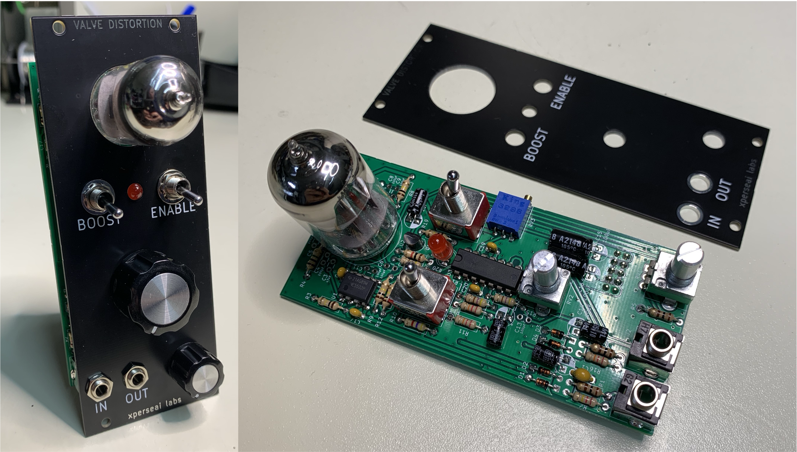
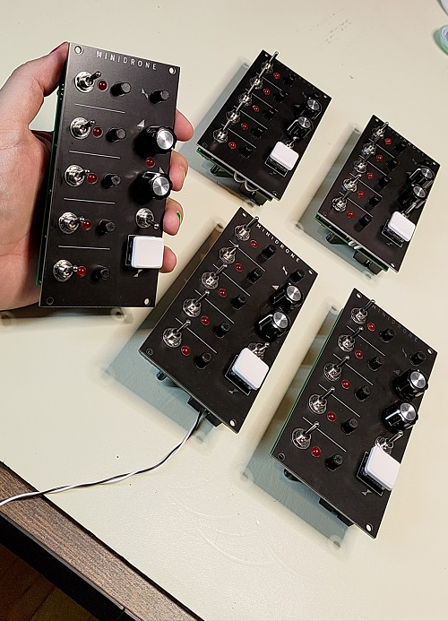
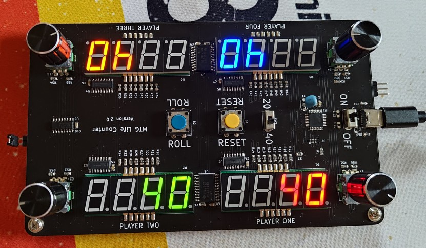
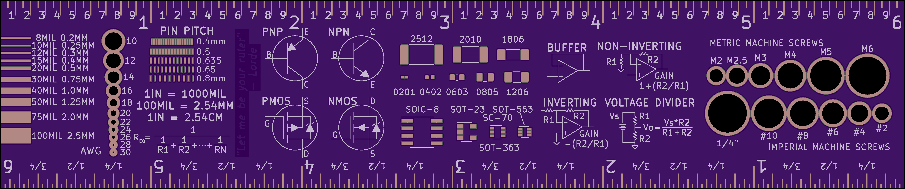
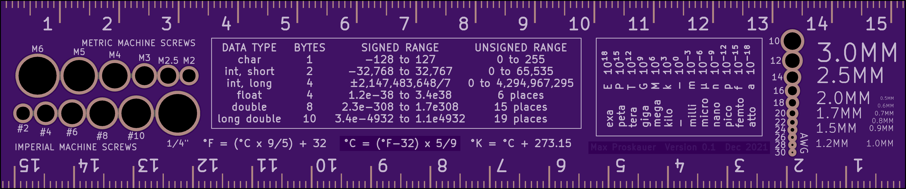
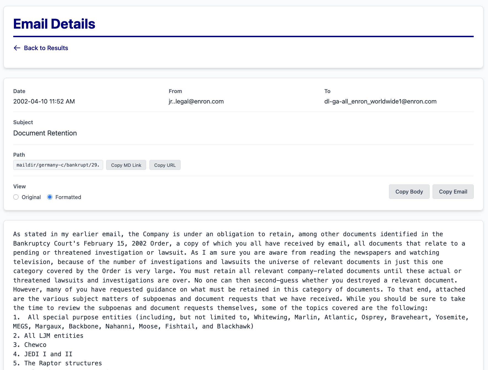

## Analog Synth

### [Wow & Flutter](https://github.com/mprosk/wow_and_flutter)

Wow & Flutter is a pitch modulation source designed to emulate the nostalgic warbles of an aged tape deck.


### [Valve Distortion](https://github.com/mprosk/valve_distortion)

Eurorack format reimplementation of the Safety Valve from Look Mum No Computer.




### [Minidrone](https://github.com/mprosk/minidrone)

Five voice analog sawtooth drone module with a built in Attack/Release amp envelope.




## Hardware

### [MTG Life Counter](https://github.com/mprosk/mtg_life_counter)

Four player life counter for *Magic: The Gathering*




### [PCB Ruler](https://github.com/mprosk/ruler)

My take on a classic PCB ruler. 6"






## Software

### [MIDI-C](https://github.com/mprosk/midi-c)

C language MIDI parser designed for embedded platforms


## Misc

### [Enron Corpus](https://mprosk.pythonanywhere.com/)

Web-based search tools for the Enron email corpus. Additional tools and scripts for offline analysis [[repo](https://github.com/mprosk/enron-corpus)]




### [stak](https://github.com/mprosk/stak)

A simple but powerful command line based RPN calculator

```
$ stak 3 7 * 4 /
[5.25]
$ stak 12.6 17 / .5 3 ^
[0.7411764705882353, 0.125]
```


### [git-marge](https://github.com/mprosk/git-marge)

Punish yourself or your users for mistyping `git merge`

```
user@hostname:~$ git marge
        ,
        (                          )
         \                        /
        ,' ,__,___,__,-._         )
        )-' ,    ,  , , (        /
       ;'"-^-.,-''"""\' \       )
       (      (        ) /  __  /
        \o,----.  o  _,'( ,.^. \
        ,'`.__  `---'    `\ \ \ \_
 ,.,. ,'                   \    ' )
 \ \ \\__  ,------------.  /     /
( \ \ \( `---.-`-^--,-,--\:     :
 \       (   (""""""`----'|     :
  \   `.  \   `.          |      \
   \   ;  ;     )      __ _\      \
   /     /    ,-.,-.'"Y  Y  \      `.
  /     :    ,`-'`-'`-'`-'`-'\       `.
 /      ;  ,'  /              \        `
/      / ,'   /                \  -hrr-

git: 'marge' is not a git command. See 'git --help'.

The most similar command is
        merge
```


## Card Games

- [Hazel's Game](https://mprosk.github.io/hazels-game/) [[repo](https://github.com/mprosk/hazels-game)]
- [The Hated Game](https://mprosk.github.io/hated-game/) [[repo](https://github.com/mprosk/hated-game)]

Coming Soon:

- Cross
- Larry's Game


